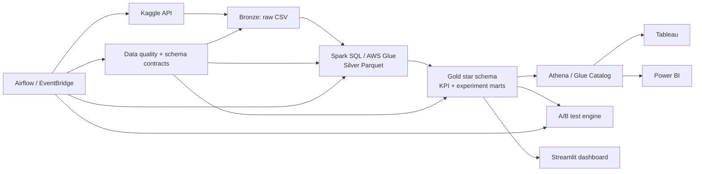

# Cloud E-Commerce Experimentation & Analytics Platform

[](https://github.com/ZhiWang-Andy/Data/actions/workflows/ci.yml)

An end-to-end analytics engineering portfolio project built on the **Kaggle Brazilian E-Commerce Public Dataset by Olist**. It demonstrates production-style data ingestion, Spark SQL transformation, AWS lakehouse infrastructure, data quality monitoring, A/B testing, and BI-ready semantic outputs for Tableau and Power BI.

> The historical Olist data is observational. The experimentation module creates a clearly labeled randomized synthetic experiment layer using real order-level covariate distributions; it does not claim that historical Olist outcomes were generated by a real product experiment.

## What this project demonstrates

- **Spark SQL / PySpark:** bronze, silver, and gold transformations; star-schema modeling; partitioned Parquet outputs.
- **AWS cloud computing:** S3 data lake, AWS Glue job, Glue Data Catalog, Athena workgroup, IAM, and scheduled orchestration defined with Terraform.
- **ETL and data pipelines:** Kaggle ingestion, idempotent transformations, quality gates, A/B analysis, and BI exports orchestrated with Airflow.
- **A/B testing:** deterministic randomization, sample-ratio-mismatch checks, two-proportion inference, confidence intervals, relative lift, and guardrails.
- **Data maintenance:** schema contracts, freshness and integrity checks, runbook, retention policy, watermarks, CI, and scheduled quality checks.
- **Dashboards:** a runnable Streamlit dashboard plus Tableau and Power BI model specifications, calculated fields, DAX, and Power Query scripts.

## Architecture



## Dataset

- Kaggle dataset slug: `olistbr/brazilian-ecommerce`
- Dataset page: `https://www.kaggle.com/datasets/olistbr/brazilian-ecommerce`
- The raw dataset is not committed to GitHub. Download it with the Kaggle API after accepting the dataset terms.

## Repository layout

```text
.
├── airflow/dags/                 # Orchestration DAG
├── aws/glue/                     # AWS Glue PySpark entrypoint
├── aws/terraform/                # S3, Glue, Athena, IAM, schedule
├── config/                       # Project config and data contracts
├── docs/                         # Architecture, experiment plan, runbook
├── powerbi/                      # Power Query and DAX semantic layer
├── sql/                          # Spark SQL KPI and mart queries
├── src/
│   ├── analytics/                # A/B experiment generation and analysis
│   ├── dashboard/                # Streamlit dashboard
│   ├── etl/                      # Spark lakehouse pipeline
│   ├── ingestion/                # Kaggle download
│   └── maintenance/              # Quality, retention, and state
├── tableau/                      # Tableau data source and calculated fields
└── tests/                        # Unit tests
```

## Quick start

### 1. Create the environment

```bash
python -m venv .venv
source .venv/bin/activate          # Windows: .venv\Scripts\activate
pip install -r requirements.txt
```

Java 17+ is recommended for local Spark. Copy `.env.example` to `.env` and configure Kaggle credentials.

### 2. Download Kaggle data

```bash
python -m src.ingestion.download_kaggle \
  --dataset olistbr/brazilian-ecommerce \
  --output data/raw
```

You may also manually place the Olist CSV files in `data/raw/`.

### 3. Build the lakehouse tables

```bash
python -m src.etl.spark_pipeline \
  --input data/raw \
  --output data/lakehouse \
  --quality-report artifacts/data_quality_report.json
```

The pipeline creates bronze source tables, silver typed entities, and gold order, KPI, seller, and customer RFM marts.

### 4. Create and analyze the experiment layer

```bash
python -m src.analytics.experiment \
  --fact-orders data/lakehouse/gold/fact_orders \
  --output data/lakehouse/gold/experiment_results
```

### 5. Launch the dashboard

```bash
streamlit run src/dashboard/app.py -- \
  --data-root data/lakehouse/gold
```

### 6. Run tests

```bash
pytest -q
ruff check .
```

## Core business questions

1. How do revenue, orders, average order value, freight share, and on-time delivery change over time?
2. Which sellers and product categories drive growth, delays, and poor reviews?
3. Which customer segments have the highest recency-frequency-monetary value?
4. Does the simulated checkout treatment improve conversion without harming average order value or delivery guardrails?
5. Are incoming data, keys, relationships, and partitions healthy enough for BI reporting?

## AWS deployment

See [`docs/aws_deployment.md`](docs/aws_deployment.md). The Terraform stack provisions a versioned S3 lake, Glue Catalog database, Glue Spark job, Athena workgroup, IAM role, and a scheduled Glue trigger. The same Spark SQL design is reusable locally and in AWS Glue.

## BI integration

- **Tableau:** connect to Athena or exported gold tables; use the fields in [`tableau/calculated_fields.md`](tableau/calculated_fields.md).
- **Power BI:** use the Athena connector or local exports; apply [`powerbi/power_query.m`](powerbi/power_query.m) and [`powerbi/measures.dax`](powerbi/measures.dax).
- **Streamlit:** a lightweight, code-reviewed dashboard for immediate portfolio demonstration.

## License

Code is released under the MIT License. The Olist dataset remains subject to its Kaggle dataset terms.
